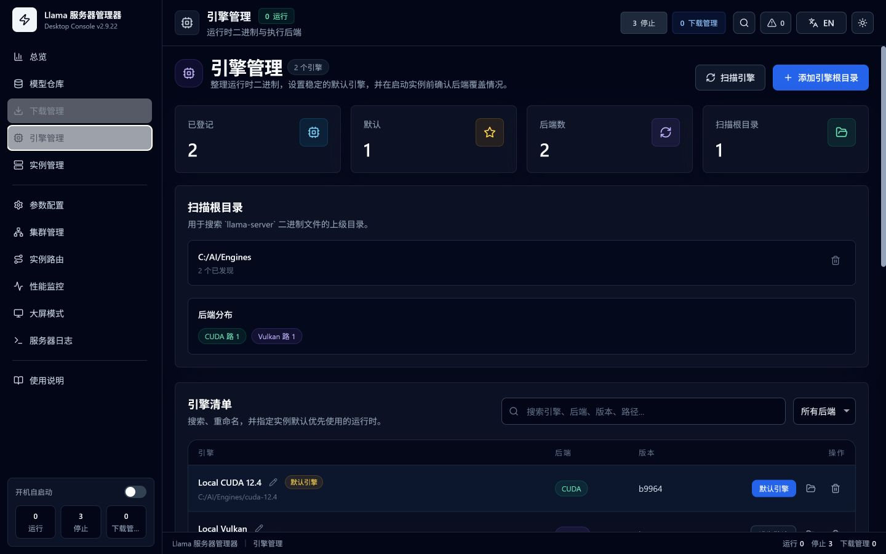
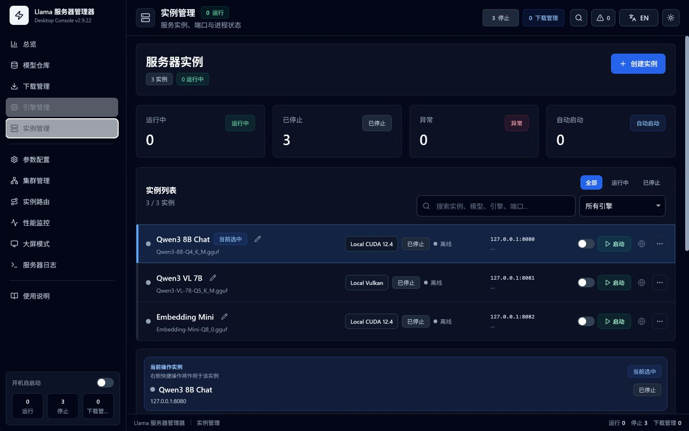
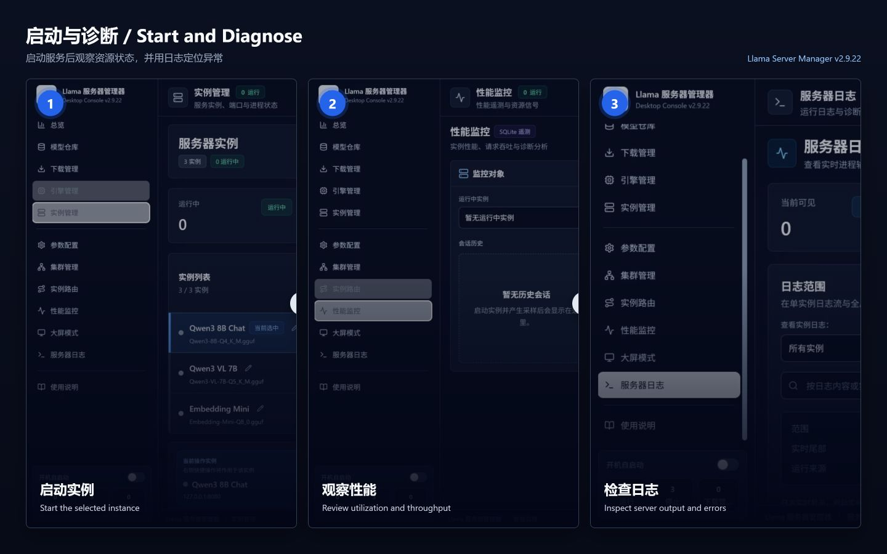
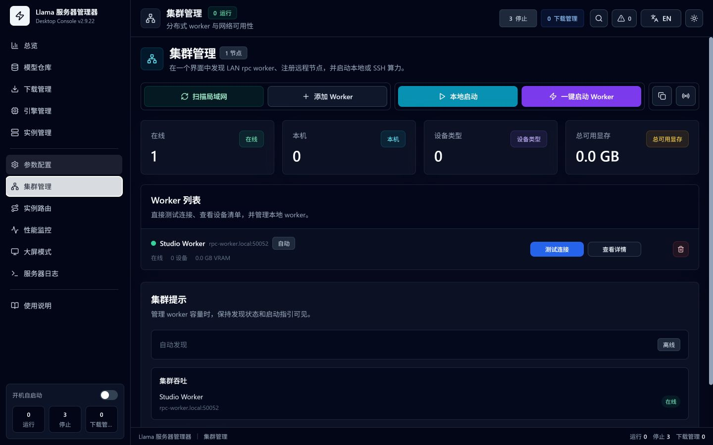
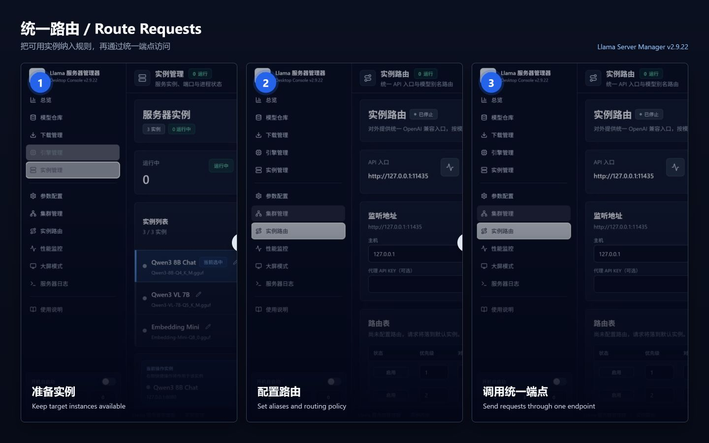
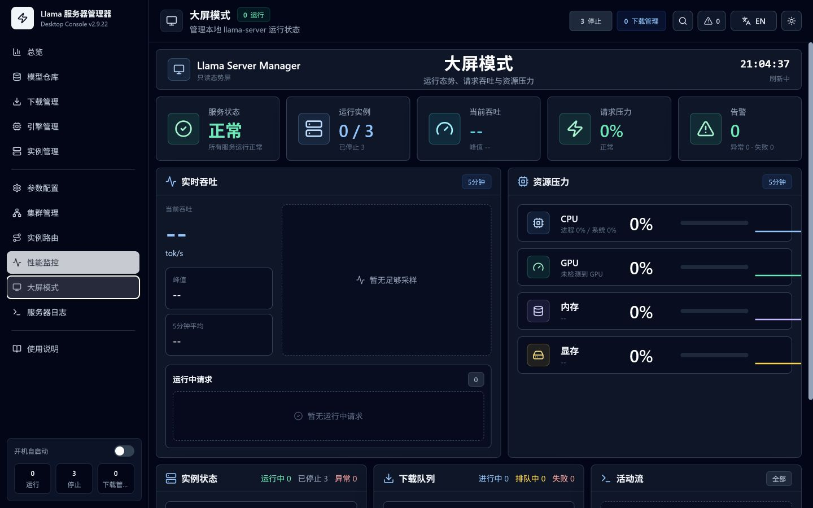
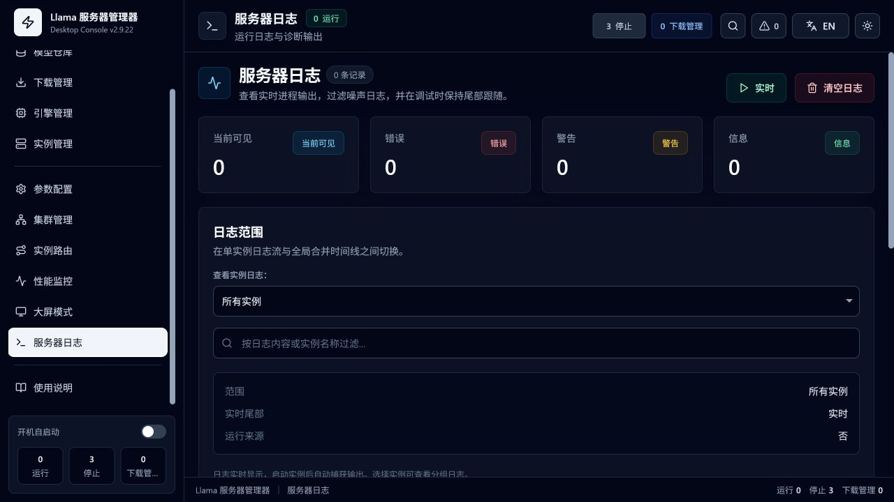

# Llama Server Manager 使用说明 / User Guide

> v2.9.28 · Windows / macOS / Linux

本说明按实际操作顺序介绍模型、引擎、实例、路由和监控功能。应用内“使用说明”页面会随安装包离线提供同一份内容和图片。

This guide follows the real workflow from models and engines to instances, routing, and monitoring. The in-app Guide ships the same content and images for offline use.

---

## 目录 / Table of Contents

1. [快速开始 / Quick Start](#快速开始-quick-start)
2. [系统总览 / Dashboard](#系统总览-dashboard)
3. [模型仓库 / Model Repository](#模型仓库-model-repository)
4. [下载管理 / Download Manager](#下载管理-download-manager)
5. [引擎管理 / Engine Management](#引擎管理-engine-management)
6. [实例管理 / Instance Management](#实例管理-instance-management)
7. [参数配置 / Parameter Configuration](#参数配置-parameter-configuration)
8. [集群管理 / Cluster Management](#集群管理-cluster-management)
9. [实例路由 / Instance Routing](#实例路由-instance-routing)
10. [性能监控 / Performance Monitoring](#性能监控-performance-monitoring)
11. [监控大屏 / Monitoring Wall](#监控大屏-monitoring-wall)
12. [服务器日志 / Server Logs](#服务器日志-server-logs)
13. [常见问题 / FAQ](#常见问题-faq)

---

## 快速开始 / Quick Start

### 安装 / Install

1. 从 [GitHub Releases](https://github.com/jerrydong1988/llama-server-manager/releases/latest) 下载对应平台安装包。
2. Windows 使用 MSI 或 NSIS 安装包；macOS 使用 DMG；Linux 使用 DEB 或 AppImage。
3. 准备与本机后端匹配的 `llama-server`，例如 CUDA、ROCm、Vulkan 或 CPU 构建。
4. 准备本地 GGUF 模型，或稍后从 ModelScope / HuggingFace 下载。

1. Download the package for your platform from [GitHub Releases](https://github.com/jerrydong1988/llama-server-manager/releases/latest).
2. Use MSI or NSIS on Windows, DMG on macOS, and DEB or AppImage on Linux.
3. Prepare a `llama-server` build for your backend, such as CUDA, ROCm, Vulkan, or CPU.
4. Prepare a local GGUF model, or download one later from ModelScope or HuggingFace.

Linux AppImage 的“开机自启动”会记录 AppImage 原始文件位置；启用后不要移动或删除该文件。正式标签构建在配置证书时执行 Windows 签名与 macOS 签名和公证；未配置时仍会发布文件名带 `-unsigned` 的 Windows 安装包和带 `-adhoc` 的 macOS DMG。普通 CI 产物仅用于测试。

AppImage autostart records the original AppImage location; do not move or delete that file after enabling it. Tagged builds use formal Windows signing and macOS signing or notarization only when credentials are configured; otherwise the release publishes clearly labeled `-unsigned` Windows installers and `-adhoc` macOS DMGs. Regular CI artifacts are for testing only.

### 首次运行的五个步骤 / Five First-Run Steps

1. 在“模型仓库”添加 GGUF 模型目录并完成扫描。
2. 在“引擎管理”添加包含 `llama-server` 的目录，并设置默认引擎。
3. 在“实例管理”创建实例，选择模型、引擎和可用端口。
4. 在“参数配置”检查模型路径、上下文、GPU 层数和服务参数，然后保存。
5. 回到“实例管理”启动实例，通过“性能监控”和“服务器日志”确认运行状态。

1. Add and scan a GGUF directory in Model Repository.
2. Add a directory containing `llama-server` in Engine Management and choose the default engine.
3. Create an instance with a model, engine, and free port.
4. Review the model path, context, GPU layers, and service options in Configuration, then save.
5. Start the instance and verify it in Performance Monitoring and Server Logs.

### 界面导航 / Navigation

左侧导航按“运行概况、资源准备、服务配置、分布式与路由、诊断、帮助”的顺序排列，共 12 个入口：系统总览、模型仓库、下载管理、引擎管理、实例管理、参数配置、集群管理、实例路由、性能监控、监控大屏、服务器日志和使用说明。

The sidebar contains 12 entries ordered around status, resources, service configuration, distributed routing, diagnostics, and help: Dashboard, Model Repository, Downloads, Engines, Instances, Configuration, Cluster, Instance Routing, Performance, Monitoring Wall, Logs, and Guide.

按 `Ctrl+K` 打开任务中心，可快速跳转页面、启动或停止实例、处理下载和查看诊断。`Ctrl+Enter` 启动或停止一个实例，`Ctrl+S` 保存配置。

Press `Ctrl+K` for the command center. `Ctrl+Enter` starts or stops an instance, and `Ctrl+S` saves configuration.

---

## 系统总览 / Dashboard

系统总览是启动后的运行控制台。即使没有实例运行，也会显示系统 CPU、内存以及可用的 GPU / 显存信息；同时汇总实例、模型、引擎、下载和需要处理的问题。

Dashboard is the launch-time control surface. It shows system CPU, memory, and available GPU or VRAM signals even before an instance is running, together with instance, model, engine, download, and attention summaries.

### 主要区域 / Main Areas

- 顶部指标：运行实例、已登记模型与引擎、活动下载。
- 系统健康：CPU、内存、GPU 和显存的实时压力。
- 实例控制：直接查看状态并启动或停止实例。
- 关注中心：引擎缺失、模型为空、实例异常或下载失败等可操作提示。
- 最近活动：请求、下载和日志摘要。

- Top metrics for running instances, registered models and engines, and active downloads.
- System health for CPU, memory, GPU, and VRAM pressure.
- Instance controls for status and start or stop actions.
- Actionable attention items for missing resources, unhealthy instances, or failed downloads.
- Recent request, download, and log activity.

如果总览提示“未登记运行引擎”或“模型仓库为空”，先按提示按钮跳转并完成资源扫描，不要直接在实例页反复启动。

When Dashboard reports a missing engine or empty model inventory, follow the action to register the resource before retrying an instance start.

---

## 模型仓库 / Model Repository

模型仓库递归扫描本地目录，识别 GGUF 模型、分片、`mmproj` 投影器和 imatrix 文件，并从 GGUF 头读取架构、上下文长度、量化类型和能力摘要。

Model Repository recursively scans local folders for GGUF models, shards, `mmproj` projectors, and imatrix files, and reads architecture, context length, quantization, and capability metadata from GGUF headers.

### 添加和扫描目录 / Add and Scan Directories

1. 点击“添加模型目录”。
2. 选择包含一个或多个模型子目录的根目录。
3. 等待递归扫描完成；后续重新扫描会复用未变化目录的缓存。
4. 使用搜索框按文件名、架构或量化类型过滤。
5. 展开目录树查看模型、投影器和分片关系。

1. Select Add Model Directory.
2. Choose a root containing one or more model subfolders.
3. Wait for recursive scanning; later scans reuse unchanged directory results.
4. Filter by file name, architecture, or quantization.
5. Expand the tree to inspect models, projectors, and shards.

### 管理操作 / Management

- “在资源管理器中打开”定位文件。
- 删除操作会显示原生确认框；确认后从磁盘永久删除，请先确认没有实例正在使用该文件。
- 分片模型按一组展示，统计时不会把每个分片重复算作独立模型。
- 视觉模型通常需要匹配的 `mmproj`；在实例或参数页选择主模型时可自动关联同目录投影器。

- Open in Explorer or Finder locates the file.
- Delete uses a native confirmation and permanently removes the file; make sure no instance is using it.
- Sharded models are grouped and not double-counted as separate models.
- Vision models commonly need a matching `mmproj`, which can be associated from the same directory.

---

## 下载管理 / Download Manager

下载管理支持 ModelScope 和 HuggingFace，可浏览仓库文件、选择单文件或批量下载，并在应用重启后恢复队列状态。

Downloads supports ModelScope and HuggingFace repository browsing, single or batch downloads, and persistent queue restoration after an app restart.

### 浏览与下载 / Browse and Download

1. 选择 ModelScope 或 HuggingFace。
2. 输入仓库 ID，例如 `Qwen/Qwen3-8B-GGUF`。
3. 选择保存目录并点击“浏览”。
4. 在文件列表中选择单文件下载，或批量加入队列。
5. 使用任务卡片暂停、继续、重试或取消。

1. Select ModelScope or HuggingFace.
2. Enter a repository ID such as `Qwen/Qwen3-8B-GGUF`.
3. Choose a save directory and browse the repository.
4. Download one file or enqueue a batch.
5. Pause, resume, retry, or cancel from task cards.

### 传输策略 / Transfer Policy

- 默认恢复策略为“手动”：应用重启后保留队列，由用户决定何时恢复。
- “启动时自动恢复”会在应用启动后恢复可继续的任务。
- 默认并发数为 1，可在策略面板调整；增加并发会提高带宽和磁盘压力。
- 带宽限制为 0 时不限速，可按所选单位设置全局上限。
- 低优先级节流适合边下载边推理，代价是下载时间增加。
- 服务端支持 Range 时会使用断点续传；已存在且大小匹配的文件会标记完成，避免重复下载。

- Manual resume is the default: queues persist across restarts and resume only when requested.
- Auto on launch resumes eligible tasks after startup.
- Concurrency defaults to 1 and can be raised at the cost of bandwidth and disk pressure.
- A bandwidth limit of 0 means unlimited.
- Low-priority throttling reduces interference with inference but extends download time.
- Range-capable servers support resume, and matching local files are detected to avoid duplicate downloads.

下载失败时先展开错误信息；鉴权失败检查仓库权限，空间不足清理目标磁盘，网络中断则保留任务后重试。取消任务会停止传输；删除最终文件前会确认目标路径属于该下载任务。

For failed downloads, inspect the error details. Check repository access for authorization failures, free disk space for write failures, and retry retained tasks after a network interruption.

---

## 引擎管理 / Engine Management

引擎管理扫描 `llama-server` 可执行文件，自动识别 CUDA、ROCm、Vulkan 或 CPU 后端，并允许多个版本并存。

Engine Management scans `llama-server` executables, detects CUDA, ROCm, Vulkan, or CPU backends, and supports multiple installed versions.

### 登记引擎 / Register Engines

1. 点击“添加引擎根目录”。
2. 选择包含一个或多个 `llama-server` 构建目录的父目录。
3. 扫描后检查可执行路径和后端标签。
4. 为常用版本设置易识别名称，并设为默认引擎。

1. Select Add Engine Root.
2. Choose a parent folder containing one or more `llama-server` builds.
3. Verify executable paths and backend labels after scanning.
4. Name the common version and set it as default.

新实例优先使用默认引擎；每个实例仍可覆盖为不同版本。升级 llama.cpp 后重新扫描即可保留多个版本并逐实例切换。

New instances prefer the default engine, while each instance can override it. Rescan after a llama.cpp upgrade to keep versions side by side.

---

## 实例管理 / Instance Management

实例把模型、引擎、端口和独立参数组合成一个可启动服务。多个实例可以同时运行，但必须使用不同端口，并考虑显存和内存总量。

An instance combines a model, engine, port, and independent configuration into a runnable service. Multiple instances may run together with unique ports and sufficient memory.

### 创建实例 / Create an Instance

1. 点击“创建实例”。
2. 输入实例名称。
3. 从模型树选择主模型，并确认需要的 `mmproj`。
4. 选择引擎；留空时使用默认引擎。
5. 输入端口并等待端口可用性检查。
6. 创建后进入参数配置检查详细参数。

1. Select Create Instance.
2. Enter an instance name.
3. Choose the main model and any required `mmproj`.
4. Select an engine or use the default.
5. Enter a port and wait for availability validation.
6. Open Configuration to review detailed parameters.

### 运行控制 / Runtime Controls

- 启动前会生成命令、检查端口和必要路径。
- 状态依次可能为已停止、启动中、运行中或错误。
- “测试连接”使用实例鉴权设置检查健康或模型接口。
- “打开 API 页面”会把通配监听地址转换为本机可访问地址。
- 命令预览可复制完整启动参数，便于复现问题。
- 可重命名、排序或删除实例；删除前会原生确认。

- Startup generates the command and validates ports and required paths.
- Status may be stopped, starting, running, or error.
- Test Connection checks health or model endpoints using the instance authentication settings.
- Open API maps wildcard bind hosts to a local browser address.
- Command Preview copies the complete launch command for diagnosis.
- Instances can be renamed, reordered, or deleted with confirmation.

启动失败时不要只重复点击启动。先看实例错误状态，再打开服务器日志检查完整命令和 stderr；常见原因是端口占用、路径不存在、后端与硬件不匹配或显存不足。

When startup fails, inspect the instance state and server logs instead of repeatedly retrying. Common causes are port conflicts, missing paths, backend mismatch, or insufficient VRAM.

---

## 参数配置 / Parameter Configuration

参数配置按当前实例保存，覆盖模型、生成、采样、性能、上下文、网络、鉴权、缓存、推测解码和多模型路由等约 159 个 llama.cpp 参数。

Configuration is stored per instance and covers about 159 llama.cpp options for models, generation, sampling, performance, context, networking, authentication, cache, speculative decoding, and routing.

### 推荐操作 / Recommended Workflow

1. 在页面顶部确认当前实例。
2. 先使用场景预设作为起点，再按硬件调整。
3. 使用搜索框输入参数名或 CLI 标志，例如 `ctx`、`gpu-layers` 或 `api-key-file`。
4. 查看参数悬停提示和右侧活动参数摘要。
5. 点击保存并处理红、黄、蓝三级校验提示。

1. Confirm the selected instance.
2. Start from a scenario preset, then tune for the hardware.
3. Search by option name or CLI flag such as `ctx`, `gpu-layers`, or `api-key-file`.
4. Review tooltips and the active-parameter summary.
5. Save and address red, amber, or blue validation findings.

### 关键配置 / Important Settings

- 上下文越大，KV 缓存占用越高；显存紧张时优先降低上下文、批大小或 GPU 层数。
- API Key 可以直接填写，也可以通过 API Key 文件提供；健康检查、测试连接、指标读取和实例路由会使用有效密钥。
- 非本机监听会扩大访问范围，应配置鉴权并检查防火墙。
- 向量模型会锁定不适用的生成参数。
- 推测解码需要主模型和草稿模型兼容；出现异常时先禁用推测解码验证基础运行。
- 自定义参数会原样追加，使用前核对当前 `llama-server --help`。

- Larger context increases KV cache usage; reduce context, batch size, or GPU layers when memory is tight.
- API keys may be inline or file-based; health, connection tests, metrics, and routing use the effective key.
- Non-local binding increases exposure and should use authentication and firewall controls.
- Embedding models lock irrelevant generation options.
- Speculative decoding requires compatible main and draft models.
- Custom arguments are appended as entered and should be checked against the current `llama-server --help`.

---

## 集群管理 / Cluster Management

集群管理用于发现和维护 llama.cpp RPC Worker，并把 Worker 地址写入实例的 RPC 配置。支持局域网发现、TCP 扫描、本机启动和 SSH 远程启动。

Cluster Management discovers and maintains llama.cpp RPC workers and feeds worker addresses into instance RPC configuration. It supports LAN discovery, TCP scanning, local launch, and SSH launch.

### 使用步骤 / Workflow

1. 扫描局域网 Worker，或手动添加主机和端口。
2. 测试连接并检查设备、内存和在线状态。
3. 本机 Worker 可选择引擎后启动；远程 Worker 需填写 SSH 连接与远端可执行路径。
4. 在实例参数配置中选择 Worker，生成 `rpc_servers`。
5. 启动实例后从日志确认 RPC 设备已连接。

1. Scan the LAN or manually add a worker host and port.
2. Test connectivity and review device, memory, and online state.
3. Launch a local worker from an engine, or provide SSH and remote executable details.
4. Select workers in instance configuration to generate `rpc_servers`.
5. Confirm RPC devices in logs after starting the instance.

USB4 适配器信息用于识别高速直连网络，但不会替代操作系统网络配置。扫描不到 Worker 时检查同网段、防火墙、RPC 端口和远端进程。

USB4 adapter details help identify high-speed direct links but do not replace OS network configuration. Check subnet, firewall, RPC port, and remote process when discovery fails.

Worker 地址支持 IPv4、主机名和 IPv6。手动填写带端口的 IPv6 地址时使用 `[::1]:50052` 形式，避免与 IPv6 地址自身的冒号混淆。

Worker addresses support IPv4, hostnames, and IPv6. When entering an IPv6 address with a port manually, use `[::1]:50052` so the port is unambiguous.

---

## 实例路由 / Instance Routing

实例路由提供一个统一的 OpenAI 兼容入口，根据请求中的模型名或别名，把流量转发到正在运行的 llama-server 实例。默认监听 `127.0.0.1:11435`。

Instance Routing exposes one OpenAI-compatible endpoint and forwards requests to running llama-server instances by requested model name or alias. The default listener is `127.0.0.1:11435`.

### 配置和启动 / Configure and Start

1. 先启动至少一个后端实例。
2. 设置监听主机和端口。
3. 为路由规则选择目标实例，并填写客户端使用的模型别名。
4. 需要时设置代理 API Key；设置后所有代理端点都需要鉴权。
5. 保存配置，然后启动实例路由。
6. 复制统一 API 入口并用 `/v1/models` 或聊天请求测试；已配置密钥时请携带 Bearer Token 或 `x-api-key`。

1. Start at least one backend instance.
2. Set the listen host and port.
3. Choose a target instance and define the model alias clients will send.
4. Configure a proxy API key when needed; once set, every proxy endpoint requires authentication.
5. Save, then start routing.
6. Copy the endpoint and test `/v1/models` or a chat request, sending a Bearer token or `x-api-key` when configured.

### 安全与后台保活 / Security and Background Keep-Alive

- 监听非本机地址时必须设置代理 API Key，否则不允许启动。
- 配置代理 API Key 后，服务首页、健康检查、模型列表和推理接口统一鉴权。
- 路由只选择当前有效目标；目标实例停止后，对应请求会失败或没有可用目标。
- 开启后台保活后，关闭窗口可继续在托盘提供统一端点。
- 当路由运行时退出应用会出现确认：可以保持托盘运行，或停止路由后真正退出。
- 修改未保存的路由草稿后直接启动时，应用会先保存有效配置，避免界面与后台状态不一致。

- A proxy API key is mandatory for non-local listeners.
- Once configured, the proxy key protects the index, health, model-list, and inference endpoints.
- Routing resolves active targets; requests fail when the selected backend is unavailable.
- Background keep-alive can continue serving from the system tray.
- Exiting while routing is active prompts to keep it in the tray or stop routing and exit.
- Starting with a valid unsaved draft persists it before launch.

---

## 性能监控 / Performance Monitoring

性能监控结合系统指标、实例指标、slots、日志时序和 SQLite 遥测，并按会话锁定生成、Embedding 或 Reranker 工作负载，展示与当前服务类型匹配的运行吞吐、历史基线和诊断建议。

Performance Monitoring combines system signals, instance metrics, slots, log timing, and SQLite telemetry. Each session is pinned to its generation, Embedding, or Reranker workload so throughput, history, and diagnostics keep the correct meaning after configuration changes.

### 查看指标 / Read the Metrics

1. 从左侧选择正在运行的实例，工作负载徽标会显示本次会话实际记录的服务类型。
2. CPU、内存、GPU 和显存是三类工作负载共用的资源信号。
3. 生成模型查看输出 tokens/s、提示处理速度、排队深度和忙碌槽位。
4. Embedding：输入 tokens/s、向量项/s 使用最近 60 秒工作窗口，并显示任务耗时 P50 / P95 和整段会话已完成向量项数。
5. Reranker：输入 tokens/s、文档项/s 使用最近 60 秒工作窗口，并显示任务耗时 P50 / P95 和整段会话已完成文档项数。
6. 任务日志覆盖应用内代理请求和绕过代理的直连请求，用于统计任务吞吐与耗时；代理请求统计仅覆盖经过实例路由的 HTTP 请求，并补充请求数、失败率及请求耗时。
7. 页面会分别标明日志来源和代理来源。某个来源没有可确认的数据时显示“不可用”或 `--`，不会用 `0` 冒充已测量结果；已测量时间桶内确实空闲时才显示零值。
8. 历史基线只比较相同模型、工作负载和后端的会话。向量服务的诊断聚焦资源压力、吞吐和 P95 变化，不显示生成模型专用的 KV 缓存、上下文和解码建议。

1. Select a running instance; the workload badge shows the service type recorded for that session.
2. CPU, memory, GPU, and VRAM are common resource signals across all workloads.
3. Generation workloads show output tokens/s, prompt processing speed, queue depth, and busy slots.
4. Embedding: input tokens/s and vector items/s over the latest 60-second work window, plus task P50/P95 latency and session-wide completed vector items.
5. Reranker: input tokens/s and document items/s over the latest 60-second work window, plus task P50/P95 latency and session-wide completed document items.
6. Task logs cover both proxied requests and direct requests that bypass the app proxy, providing task throughput and latency. Proxied request telemetry covers only HTTP traffic routed by the app and adds request count, failure rate, and request latency.
7. Log and proxy source availability are shown separately. Missing evidence is labeled unavailable or `--`, never presented as a measured zero; zero is used only for an observed idle bucket.
8. Historical baselines compare sessions with the same model, workload, and backend. Vector diagnostics focus on resource pressure, throughput, and P95 changes without generation-only KV-cache, context, or decoding advice.

AMD 指标优先使用 ADLX，NVIDIA 使用 NVML，无法取得 GPU 指标时会回退到系统指标。页面没有实例时不会保留上一个实例的过期实时数据。

AMD signals prefer ADLX and NVIDIA uses NVML; the app falls back to system metrics when GPU telemetry is unavailable. Stale live instance metrics are cleared when no instance is selected.

---

## 监控大屏 / Monitoring Wall

监控大屏把实例、吞吐、请求压力、下载、日志和告警压缩到一页，适合持续观察，不用于修改配置。

Monitoring Wall condenses instances, throughput, request pressure, downloads, logs, and alerts into one read-only operational view.

- 顶部显示更新时间和整体服务状态。
- KPI 展示运行实例、当前与峰值吞吐、请求压力和告警数。
- 实例吞吐按实例聚合，避免把同一请求或排队数重复计算。
- 下载和日志区域用于发现近期失败，不替代下载页或日志页的详细操作。
- 数据不可用时显示真实空状态或降级信息，不填充模拟指标。

- The header shows update time and overall service status.
- KPIs cover running instances, current and peak throughput, request pressure, and alerts.
- Throughput is aggregated per instance without double-counting request or queue data.
- Download and log summaries surface recent failures but do not replace detailed pages.
- Unavailable data remains an honest empty or degraded state.

---

## 服务器日志 / Server Logs

服务器日志集中显示实例 stdout / stderr、启动命令、PID、健康检查和性能时序。日志按实例写入文件，应用重启后可恢复查看。

Server Logs collects instance stdout and stderr, startup commands, PIDs, health checks, and timing output. Per-instance logs persist and can be restored after restart.

### 使用方法 / Usage

- 按实例筛选，或查看全部实例。
- 自动跟随开启时保持在最新日志；向上滚动会暂停跟随，返回底部后可恢复。
- 错误、警告、就绪和性能关键词使用不同颜色。
- 清空日志只清理当前视图对应内容，操作前确认筛选范围。
- 启动失败先查完整命令，再查紧随其后的 stderr。

- Filter by one instance or view all.
- Tail follow stays on the newest line; scrolling up pauses it until returning to the bottom.
- Errors, warnings, readiness, and performance terms use distinct colors.
- Clear applies to the selected log scope.
- For startup failures, inspect the full command and the following stderr lines.

常见信号：`address already in use` 表示端口冲突；模型文件打开失败表示路径或权限问题；GPU 分配失败通常需要降低 GPU 层数、上下文或批大小；健康接口暂时返回错误但模型接口可用时，连接测试会使用兼容回退判断。

Common signals include port conflicts, model path or permission errors, GPU allocation failures, and transient health endpoint errors. Connection tests can use compatible model endpoint fallback when appropriate.

---

## 常见问题 / FAQ

### 为什么没有检测到引擎？ / Why is no engine detected?

进入“引擎管理”，添加包含实际 `llama-server` 可执行文件的根目录并重新扫描。若只选择了源码目录而没有构建产物，不会识别为引擎。

Add and rescan a root containing the actual `llama-server` executable. A source-only directory is not an engine.

### 为什么实例端口不可用？ / Why is the instance port unavailable?

该端口正在被其他实例或进程监听。选择新端口，或停止占用端口的进程后等待检查刷新。实例路由端口也不能与后端实例端口重复。

Another process is listening on the port. Choose another port or stop the owner. The routing listener also needs a unique port.

### 为什么实例立即进入错误状态？ / Why does an instance fail immediately?

打开服务器日志，检查启动命令后的第一条错误。依次核对模型路径、引擎路径、后端类型、端口、GPU 层数、上下文和可用内存。

Open Server Logs and inspect the first error after the startup command. Check model and engine paths, backend, port, GPU layers, context, and memory.

### API 返回未授权怎么办？ / What if the API returns unauthorized?

确认客户端使用的是实例 API Key 或实例路由的代理 API Key。若实例通过 `api_key_file` 提供密钥，检查文件存在、可读，并确认第一条非空内容正确。

Use the instance key or the routing proxy key as appropriate. For `api_key_file`, verify the file and its first non-empty line.

### 为什么非本机路由无法启动？ / Why can routing not bind publicly?

实例路由在监听非本机地址时强制要求代理 API Key。设置密钥、保存配置，再检查端口和防火墙后启动。

Non-local routing requires a proxy API key. Set and save it, then verify the port and firewall.

### 应用重启后下载怎么办？ / What happens to downloads after restart?

队列和断点状态会保存。默认“手动”策略等待你点击恢复；选择“启动时自动恢复”后，符合条件的任务会自动继续。

Queue and partial state persist. Manual policy waits for user action; Auto on Launch resumes eligible tasks.

### 性能页为什么没有 GPU 数据？ / Why is GPU telemetry missing?

确认驱动正常并且当前平台可使用 ADLX 或 NVML。采集失败时应用会回退系统指标；这不一定表示实例未使用 GPU，应结合服务器日志确认后端加载。

Verify the driver and ADLX or NVML availability. System fallback does not by itself mean the server is not using a GPU; confirm backend loading in logs.

macOS 当前没有 ADLX 或 NVML 数据源，因此 Apple GPU/统一内存不会显示为独立显存指标；CPU、系统内存、吞吐、slots 和日志遥测仍可使用。

macOS currently has no ADLX or NVML source, so Apple GPU and unified memory are not reported as separate VRAM metrics. CPU, system memory, throughput, slots, and log telemetry remain available.

### 主配置损坏怎么办？ / What if the main configuration is corrupt?

应用会自动尝试 `instances.json.bak`。仍无法启动时，先备份整个配置目录，再检查两个 JSON 文件；不要直接删除日志、下载状态或遥测数据库来猜测修复。

The app automatically tries `instances.json.bak`. If recovery still fails, back up the full configuration directory before inspecting both JSON files.

### 应用内图片是否需要联网？ / Do in-app guide images require a network connection?

不需要。说明截图位于安装包的 `docs/guide` 资源目录中；GitHub README 和手册也引用仓库内同一批文件。

No. Guide images ship under `docs/guide` in the frontend bundle and are shared with repository documentation.
