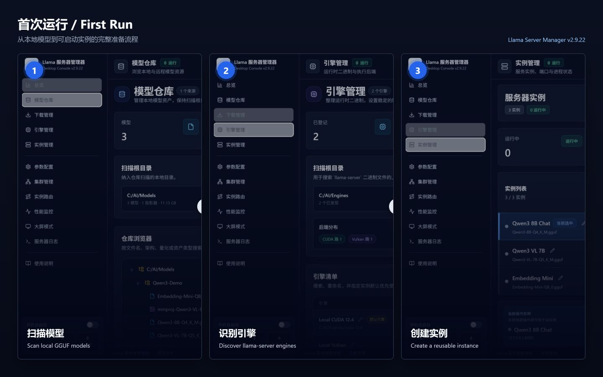
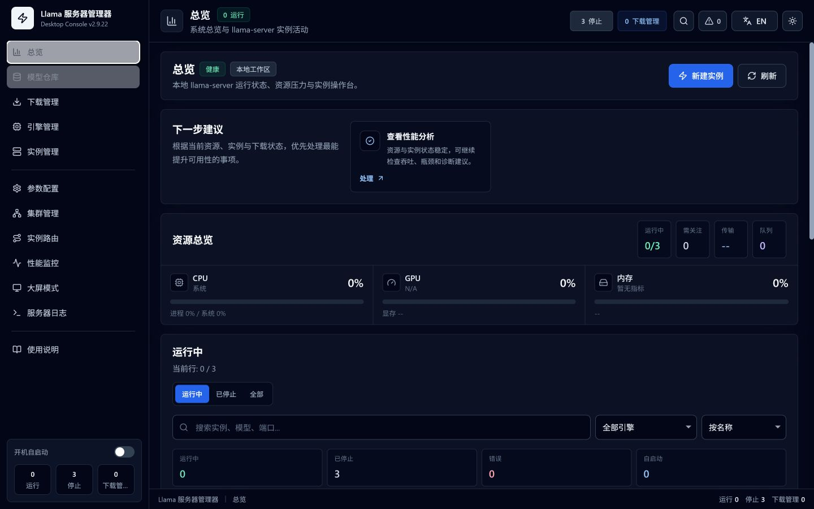
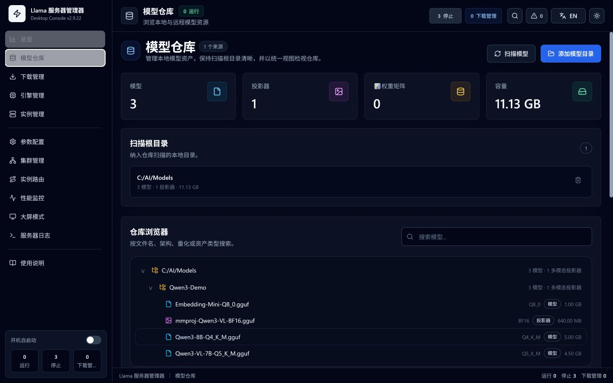
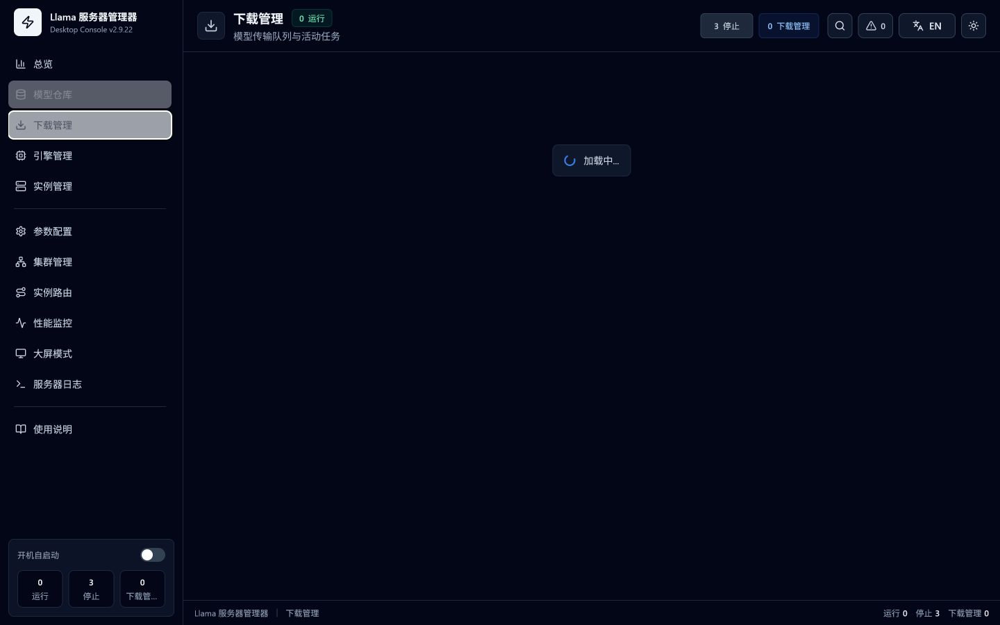
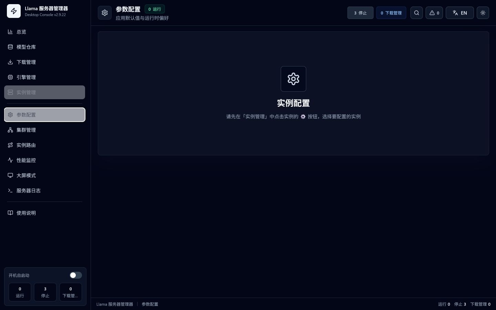
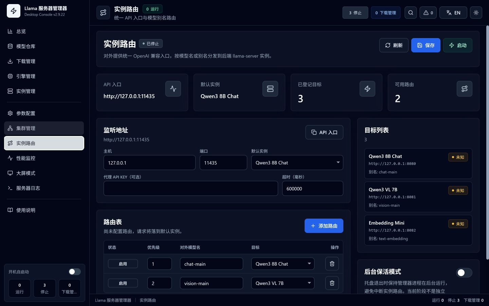
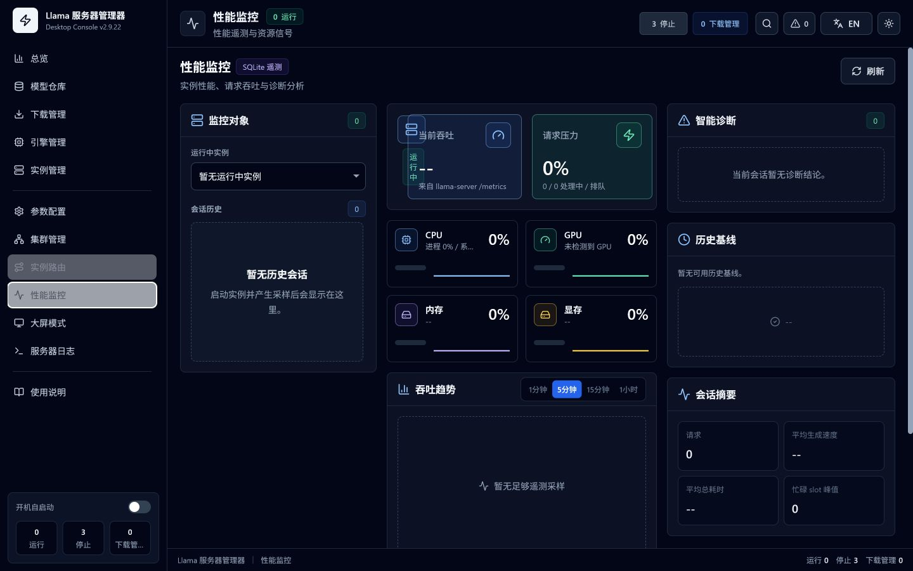

# Llama Server Manager / Llama 服务器管理器

> Windows、macOS、Linux 已验证 | Verified on Windows, macOS, and Linux

Llama Server Manager 是面向 `llama-server` 的桌面管理器，覆盖模型下载与扫描、引擎管理、实例配置与启停、集群 Worker、统一 API 路由、性能遥测和日志诊断。

Llama Server Manager is a desktop manager for `llama-server`, covering model downloads and inventory, engine management, instance lifecycle, cluster workers, unified API routing, performance telemetry, and logs.

[下载最新版 / Download Latest](https://github.com/jerrydong1988/llama-server-manager/releases/latest) | [完整使用说明 / Full User Guide](GUIDE.md) | [发布签名配置 / Release Signing](docs/RELEASE_SIGNING.md) | [隐私政策 / Privacy](PRIVACY.md) | [代码签名政策 / Code Signing](CODE_SIGNING_POLICY.md)

## 快速开始 / Quick Start

1. 在“模型仓库”添加本地 GGUF 目录，或从“下载管理”获取模型。
2. 在“引擎管理”扫描包含 `llama-server` 的目录并设置默认引擎。
3. 在“实例管理”创建实例，选择模型、引擎和可用端口。
4. 在“参数配置”检查上下文、GPU 层数、鉴权和服务参数，然后保存。
5. 启动实例，通过“性能监控”和“服务器日志”确认运行状态。

1. Add a local GGUF directory or download a model.
2. Scan `llama-server` builds and choose a default engine.
3. Create an instance with a model, engine, and free port.
4. Review context, GPU layers, authentication, and service options, then save.
5. Start the instance and verify it in Performance and Logs.



## 界面预览 / Interface Preview

### 系统总览 / Dashboard

汇总系统资源、实例状态、模型、引擎、下载和需要处理的问题。

System resources, instances, models, engines, downloads, and actionable issues in one view.



### 模型与下载 / Models and Downloads

递归扫描 GGUF 目录，识别模型、分片和投影器；支持 ModelScope 与 HuggingFace 队列下载、断点续传、并发和限速策略。

Scan GGUF models, shards, and projectors; manage ModelScope and HuggingFace queues with resume, concurrency, and bandwidth policies.





### 实例配置 / Instance Configuration

为每个实例独立选择模型、引擎和端口，通过参数搜索、场景预设和分级校验调整约 159 个 llama.cpp 参数。

Choose model, engine, and port per instance, then tune about 159 llama.cpp options with search, presets, and validation.



### 实例路由 / Instance Routing

把多个运行实例聚合为统一 OpenAI 兼容入口，按模型名或别名分发，并支持鉴权与后台保活。

Expose running instances through one OpenAI-compatible endpoint with aliases, authentication, and background keep-alive.



### 性能监控 / Performance Monitoring

查看 CPU、内存、GPU、显存、tokens/s、slots、请求历史、会话对比和诊断建议。

Inspect CPU, memory, GPU, VRAM, tokens per second, slots, request history, session comparisons, and diagnostics.



## 功能地图 / Feature Map

| 页面 | 主要能力 | Page | Main capability |
|---|---|---|---|
| 系统总览 | 系统健康、实例控制、关注中心、近期活动 | Dashboard | Health, instance controls, attention items, recent activity |
| 模型仓库 | GGUF 递归扫描、元信息、分片与投影器识别 | Models | Recursive inventory, metadata, shards, and projectors |
| 下载管理 | 双源浏览、队列、暂停恢复、并发、限速 | Downloads | Dual-source browsing, queues, resume, concurrency, throttling |
| 引擎管理 | 多版本扫描、后端识别、默认引擎 | Engines | Multi-version scanning, backend detection, defaults |
| 实例管理 | 多实例、端口检查、启停、连接测试、命令预览 | Instances | Multi-instance lifecycle, port checks, health, command preview |
| 参数配置 | 搜索、预设、校验、鉴权、缓存和推测解码 | Configuration | Search, presets, validation, auth, cache, speculative decoding |
| 集群管理 | Worker 发现、本地与 SSH 启动、RPC 配置 | Cluster | Worker discovery, local or SSH launch, RPC configuration |
| 实例路由 | 统一 API、模型别名、鉴权、后台保活 | Routing | Unified API, aliases, authentication, keep-alive |
| 性能监控 | 实时指标、SQLite 遥测、请求分析和诊断 | Performance | Live metrics, SQLite telemetry, request analysis, diagnostics |
| 监控大屏 | 服务健康、吞吐、压力、下载和告警 | Monitoring Wall | Health, throughput, pressure, downloads, alerts |
| 服务器日志 | 实时 stdout/stderr、筛选、跟随和持久化 | Logs | Live output, filtering, tail follow, persistence |
| 使用说明 | 离线图文手册、启用检查和 11 步引导 | Guide | Offline illustrated manual, checklist, 11-step tour |

## 关键特性 / Key Features

- Tauri 2 + React 18 + TypeScript 桌面应用。
- 完整中英双语界面、深色 / 明亮主题、窗口状态记忆。
- AMD ADLX、NVIDIA NVML 和系统指标自适应降级。
- 实例 API Key 与 API Key 文件支持，统一路由可独立鉴权并保护全部代理端点。
- 原子配置保存、`instances.json.bak` 回退、下载队列与日志持久化。
- 端口冲突、路径、配置规则和启动健康检查。
- 系统托盘、实例自动启动、路由后台保活和更新检查。

- Tauri 2, React 18, and TypeScript desktop application.
- Full Chinese and English UI, light and dark themes, persisted window state.
- AMD ADLX, NVIDIA NVML, and system-metric fallback.
- Inline or file-based instance keys plus routing authentication across every proxy endpoint.
- Atomic configuration saves, backup fallback, persistent downloads and logs.
- Port, path, configuration, startup, and health validation.
- System tray, instance auto-start, routing keep-alive, and update checks.

## 系统要求 / Requirements

运行已构建安装包不需要安装 Rust 或 Node.js。你需要：

- Windows 10/11、macOS 13+（Apple Silicon）或 Ubuntu 22.04+。
- 与硬件和驱动匹配的 `llama-server`。
- 至少一个 GGUF 模型，或可访问 ModelScope / HuggingFace 的网络。
- 足够容纳模型、上下文和 KV 缓存的内存或显存。

Built packages do not require Rust or Node.js. You need a supported OS, a compatible `llama-server`, a GGUF model or repository access, and enough memory for the model and KV cache.

## 从源码构建 / Build from Source

源码构建需要 Node.js 20、Rust stable 和对应平台的 Tauri 系统依赖。

Source builds require Node.js 20, stable Rust, and platform-specific Tauri dependencies.

```bash
git clone https://github.com/jerrydong1988/llama-server-manager.git
cd llama-server-manager
npm install
npm run tauri dev
```

生产构建 / Production build:

```bash
npm run tauri build
```

Ubuntu / Debian 构建依赖：

```bash
sudo apt install libwebkit2gtk-4.1-dev libappindicator3-dev librsvg2-dev patchelf
```

没有配置 Apple Developer 凭据时，macOS 构建使用 ad-hoc 签名并正常发布。首次运行可能被 Gatekeeper 提示；如信任本项目，可移除本地下载隔离属性：

```bash
xattr -cr /Applications/LlamaServerManager.app
```

正式 `v*` 标签不会因缺少商业证书而停止发布。配置 SignPath 后 Windows 安装包会自动提交签名；配置 Apple Developer 凭据后 macOS 安装包会自动签名并公证。未配置时，CI 会明确标记相应产物为未签名或 ad-hoc 签名，配置方法见[发布签名配置](docs/RELEASE_SIGNING.md)。

## 使用说明与问题反馈 / Guide and Support

- [完整图文使用说明 / Full Illustrated User Guide](GUIDE.md)
- [隐私政策 / Privacy Policy](PRIVACY.md)
- [代码签名政策 / Code Signing Policy](CODE_SIGNING_POLICY.md)
- 应用内左侧“使用说明”可离线查看同一内容，并启动交互式引导。
- 提交问题前请附版本、平台、后端类型和已脱敏的服务器日志；不要上传 API Key、私有路径或 SSH 凭据。

- The in-app Guide provides the same content offline and launches the interactive walkthrough.
- Include version, platform, backend, and redacted logs in issue reports. Never expose keys, private paths, or SSH credentials.

## License

MIT
